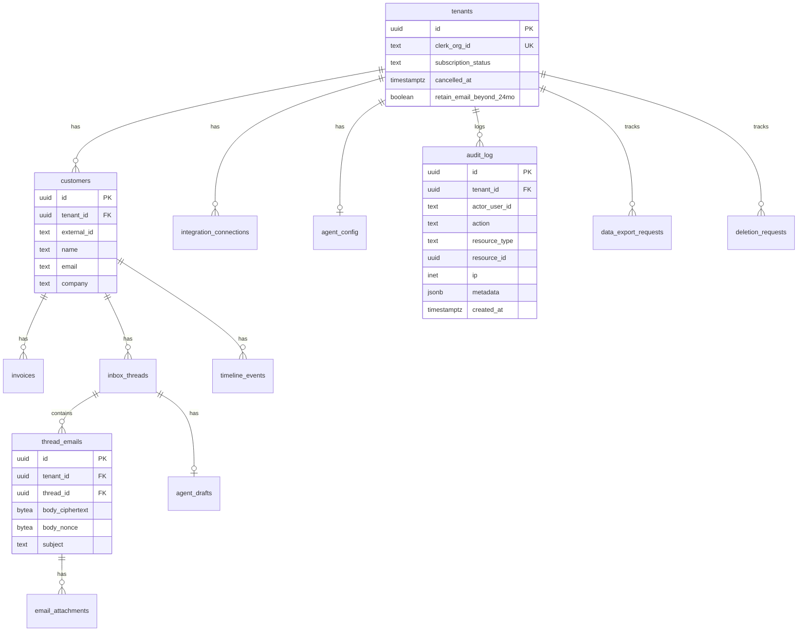

# RevCollect Data Layer and Compliance Architecture

Single source of truth for how RevCollect stores, processes, and deletes personal data. Backend implementation is deferred until frontend design is frozen; this document defines the contract for that sprint.

## Roles

| Party | Role | Responsibility |
|-------|------|----------------|
| RevCollect customer (bookkeeper / business) | **Data controller** | Decides what data to sync, whom to contact, and when to send collections emails |
| RevCollect (Nextgrid Digital) | **Data processor** | Processes data on the controller's behalf to provide collections follow-up |
| Anthropic / OpenAI | **Sub-processor** | Inference-only LLM API calls for draft generation and classification |
| Resend / Postmark | **Sub-processor** | Email delivery |
| Supabase | **Sub-processor** | Database hosting (encrypted at rest) |
| Vercel | **Sub-processor** | Application hosting |
| Clerk | **Sub-processor** | Authentication and organization (workspace) management |
| Stripe | **Sub-processor** | Billing |
| Xero / QuickBooks | **Data source** (not sub-processor) | OAuth-synced invoice and contact data; governed by partner API terms |

## Data categories

| Category | Examples | Sensitivity |
|----------|----------|-------------|
| Contact information | Names, email addresses, phone numbers of the controller's clients | High |
| Financial data | Invoice amounts, payment history, outstanding balances, aging buckets | High |
| Communication content | Email subject, body, attachments, SMS content | **Highest** |
| Behavioral metadata | Response times, reply intent classification, payment patterns, DSO | Medium |

## Entity-relationship model

Every tenant-scoped table includes `tenant_id uuid not null`, `created_at timestamptz`, and optional `deleted_at timestamptz` for soft-delete where needed.



### PII field classification

| Table | Column | Classification | Notes |
|-------|--------|----------------|-------|
| `customers` | `name`, `email`, `company` | PII | Controller's end-customer |
| `invoices` | `number`, `amount_cents`, `due_date` | Financial PII | Linked to customer |
| `thread_emails` | `subject`, `body_ciphertext` | **Sensitive PII** | Field-level AES-256-GCM encryption |
| `thread_emails` | `from`, `to`, `cc` | PII | Email addresses |
| `email_attachments` | `filename`, storage path | Metadata | Binary in Supabase Storage |
| `timeline_events` | `title`, `description` | May contain PII | Derived from communications |
| `agent_drafts` | `body` | Sensitive | AI-generated; same encryption as emails |
| `audit_log` | `metadata` | Must not contain email bodies | IDs and action types only |

## Tenant isolation

- **Application layer:** All Server Actions resolve `tenant_id` from Clerk `org_id` before any query.
- **Database layer:** Row Level Security on every table in `public`:

```sql
-- Pattern when using JWT claims (Supabase Auth)
USING (tenant_id = (auth.jwt() ->> 'tenant_id')::uuid)

-- Pattern when using Clerk-only server access
USING (tenant_id = current_setting('app.tenant_id', true)::uuid)
```

Server Actions call `SET LOCAL app.tenant_id = '<uuid>'` at the start of each transaction.

## Retention policy

| Trigger | Action | Enforced by |
|---------|--------|-------------|
| Active subscription | Retain all data | Default |
| Subscription cancelled | **30 days** after `cancelled_at`, run `delete_tenant()` | `purge_cancelled_tenants()` daily job |
| Email body age | **24 months** after `sent_at`, purge `body_ciphertext` (keep metadata row) | `purge_expired_email_content()` daily job |
| Tenant opt-out flag | `tenants.retain_email_beyond_24mo = true` skips 24-month purge | Per-tenant setting |

Constants (also in `src/features/revcollect/api/types.ts`):

- `RETENTION_POST_CANCEL_DAYS = 30`
- `RETENTION_EMAIL_BODY_MONTHS = 24`

## Right to erasure

`delete_tenant(p_tenant_id uuid)` (SECURITY DEFINER in `private` schema):

1. Delete all rows in tenant-scoped tables (customers, invoices, threads, emails, attachments, drafts, timeline, integrations).
2. Delete files in Supabase Storage under `tenants/{tenant_id}/`.
3. Redact `audit_log.metadata` for the tenant; retain tombstone rows for legal/compliance (actor, action, timestamp) without PII.
4. Mark `deletion_requests` as completed.

End-customer erasure (controller-initiated): `delete_customer(p_tenant_id, p_customer_id)` cascades that customer's PII only.

## AI inference flow

```mermaid
sequenceDiagram
  participant App as Server Action
  participant DB as Postgres
  participant AI as Anthropic/OpenAI API

  App->>DB: Load minimized context (invoice summary, recent emails decrypted in memory)
  App->>AI: Single inference request (prompt context, no training flag)
  AI-->>App: Draft text
  App->>DB: Store draft (encrypted)
  Note over App,AI: Prompt discarded after response; never logged to training pipelines
```

**Rules:**

- Inference only — no fine-tuning, no feedback loops using customer data.
- Log `tenant_id`, `thread_id`, `model`, `token_count`, `latency` — never log email bodies or full prompts.
- Sentry: scrub PII from error reports.
- Xero API data (effective March 2, 2026): may be used as inference input; **must not** be used to train or improve ML models.

## Data export

`export_tenant_data(p_tenant_id)` returns machine-readable JSON within 30 days of request:

- Customers, invoices, threads (decrypted bodies), timeline, agent config, integration metadata.
- Tracked in `data_export_requests` with status workflow.

## Sub-processors

Published at `/sub-processors`. Internal copy maintained in sync with legal pages.

## Auth model (backend sprint)

- Clerk Organizations: `tenant_id = clerk_org_id` (UUID mapping table in `tenants.clerk_org_id`).
- All Postgres access via Server Actions with secret key — never expose `service_role` to the browser.
- RLS as defense-in-depth even for server-side queries.

## Certification roadmap (deferred)

| Milestone | Target | Notes |
|-----------|--------|-------|
| SOC 2 Type I | Month 12–18 | Mid-market procurement |
| SOC 2 Type II | Month 24 | Enterprise |
| ISO 27001 | Only if EU enterprise | Overkill for SMB |

## Related documents

- [incident-response.md](./incident-response.md)
- [xero-partner-compliance.md](./xero-partner-compliance.md)
- [ai-inference-policy.md](./ai-inference-policy.md)
- SQL migrations: [`supabase/migrations/`](../supabase/migrations/)
